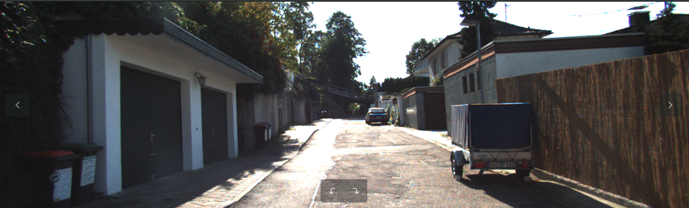
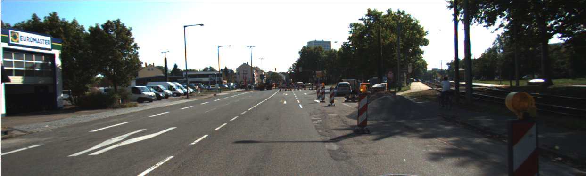
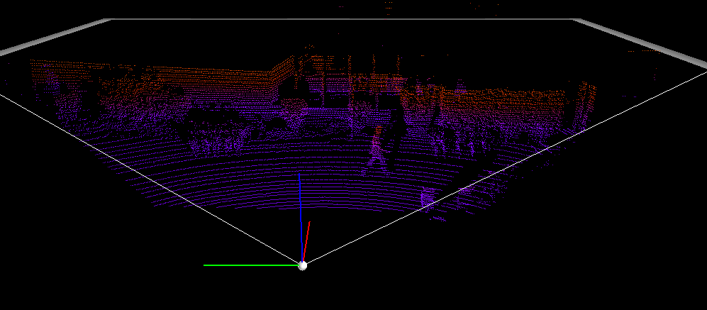
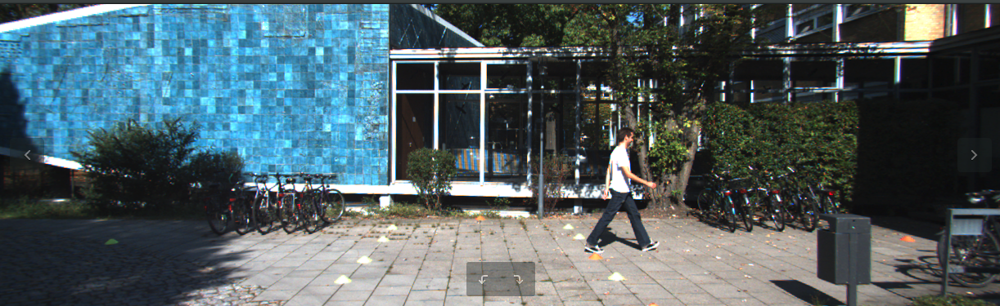
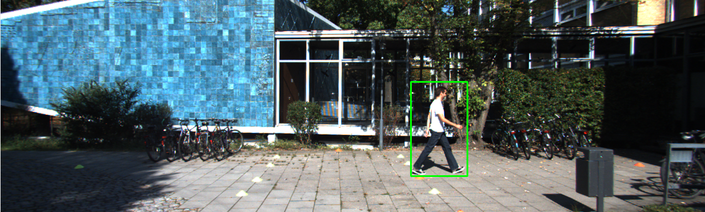
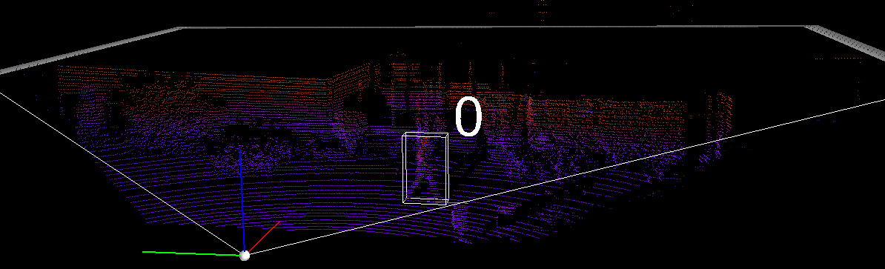
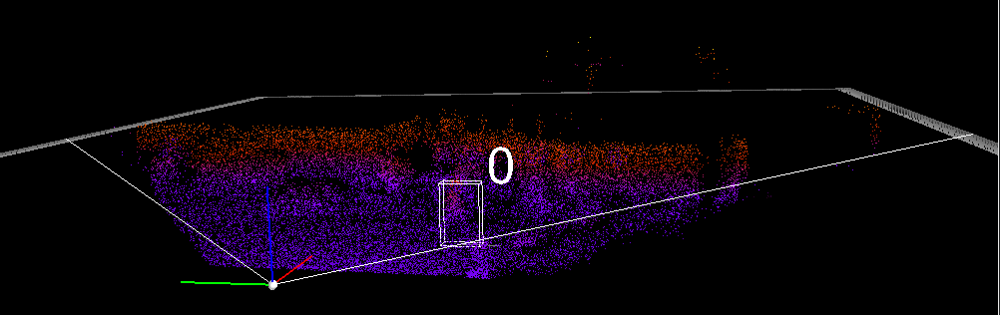

# KITTI Dataset Exploration

## Overview
KITTI 2017 dataset was collected, arranged and provided openly to allow researchers/engineers to engage in self-driving-car research and engineering.
The dataset was collected by mounting stereo color cameras and a Velodyne LiDAR, a laser Detector and Ranger. 


## Data exploration
The stereo cameras are plain images captured during the car drive through rural and city areas.

Camera Examples:




The lidar cloud points are given as a numpy array (in binary) that needs to be reshaped to 3d

(Code snippet):

``` python
velodyne_image = np.fromfile(file, dtype=np.float32)
velodyne_image = velodyne_image.reshape((-1, 4))
```

Once the LIDAR point cloud is loaded, it can be plotted. To plot the image, I used as a reference the “Frustum PointNets” found on GitHub (I found them via the leading board on the benchmark evaluation section)



Now let’s compare it to the corresponding camera photo:



Very interesting. The pedestrian, as well as the trash can,  cast a shadow that is easily detectable by the camera and the LIDAR, makes perfect sense. 


## Labels

The KITTI dataset also comes with labels- classification of the objects in the dataset, namely cars, cyclists, pedestrians and tram. Parts of each frame in the train dataset are labeled in accordance with the frame content. For instance, for the frame above, the corresponding label is:

  ```Pedestrian 0.00 0 -0.20 712.40 143.00 810.73 307.92 1.89 0.48 1.20 1.84 1.47 8.41 0.01```
  
The first value, pedestrian the the type of the object, the next two values indicates the degree to which the object is  truncated and/or occluded. The single pedestrian in the frame is entirely visible, hence the 0 values.
The next 12 values indicate (x,y range, height, width, length and location in the camera coordinate system). 

Let’s plot both the camera and the LIDAR images with the labels. 




For the camera image, we’re using just the first 4 coordinates (x,y) to plot the 2D box, while for the LIDAR image all the values of the label are used to plot the 3D box after transforming to the LIDAR coordinate system. 


## Multiple LIDARs in the same area
Self driving cars are not that common, but this will change quickly during the next few years. When that happens, we can expect multiple LIDARS (from different cars) firing laser beams on the scene that will bounce back to all the LIDARS detector. To simulate such a scenario, we can modify one of the LIDAR images and synthesize other LIDAR data and visualize the effect.
The second LIDAR in the area will be simulated by a small random number that would be added to the original LIDAR image
Code snippet:

```python
pc_velo_with_noise = pc_velo + 0.3*np.random.rand(*pc_velo.shape)
show_lidar_with_boxes(pc_velo_with_noise, objects, calib, True, img_width, img_height)
```

And the resulting image:




The LIDAR image is much softer now with all the added noise, as expected. Granted, advancements in LIDAR technology could allow to differentiate between different LIDARS (by using different frequencies, different digital encoding that would be modulated into the laser pulses…) and that might workaround the issue, assuming it won’t slow down the LIDAR spin which also would reduce resolution. In any case, as I understand it, this issue should be taken under consideration. 


## Next interesting projects
* Train an object classifier on camera images and velodyne images
   * test trained model on KITTI benchmarks
* plot 3D boxes on camera images
