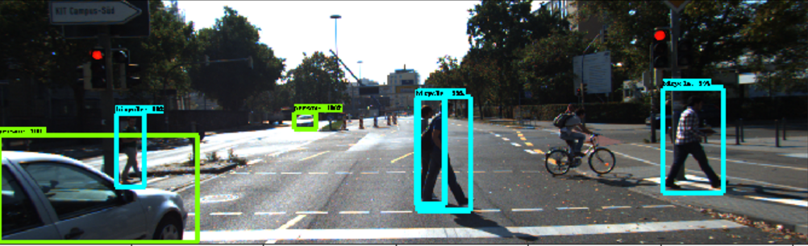
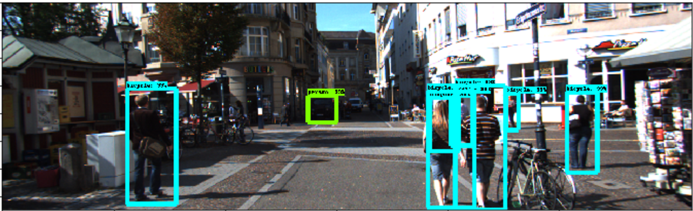
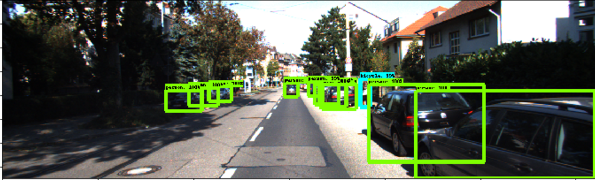
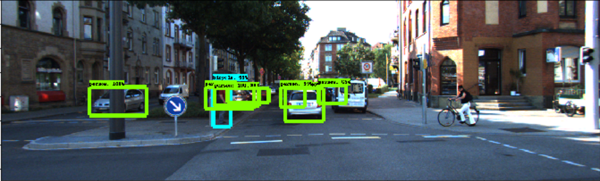

# Pedestrian Detector

Using object detection in tensorflow, I built a prototipe of pedestrian detector.
The object detection algorithm, which was trained on the KITTI dataset, detects cars, pedestrian, cyclists etc. My pedestrian detector will focus on detecting pedestrians that are in front of the car and are close enough. 
The detector is implemented on tensorflow object detection and I used the pre-trained faster_rcnn_resnet101_kitti downloaded from the model zoo ([link](https://github.com/tensorflow/models/blob/master/research/object_detection/g3doc/detection_model_zoo.md))

Let's define what "in front of the car" means. The object detector generates for each image the coordinates of the surrounding box for each of the identified subjects. Pedestrians that may require emergency-break would be between 0.25 and 0.75 of the horizontal axis of the frame (y).

`(ymin>0.25 and ymin<0.75) or (ymax>0.25 and ymax<0.75)`

Let's define what "close" means. Close pedestrians would apear bigger in the frame (take more space of the total frame). Object that are high enough would be considered as close. High is defined as 

`xmax-xmin>0.4`

# Running the pedestrian detector on the KITTI dataset
I ran the pedestrian detector on the KITTI dataset (both train and test) and chose examples of images on which a close pedestrian was detected and also images on which far pedestrians were detected.

Example: 

Close Pedestrians that satisfy the condition `((ymin>0.25 and ymin<0.75) or (ymax>0.25 and ymax<0.75)) and xmax-xmin>0.4`

Pedestrian warning

Pedestrian warning

Far pedestrians that don't satisfy the condition `((ymin>0.25 and ymin<0.75) or (ymax>0.25 and ymax<0.75)) and xmax-xmin>0.4`

No pedestrian warning

No pedestrian warning

# Next interesting steps:
1. Use a lane detector to understand better if the pedestrian is in the car lane or not.
2. Use telemetry data to determine of the car speed is too high and if it is approaching the pedestrian too fast.
3. detect other types of objects other than pedestrians
