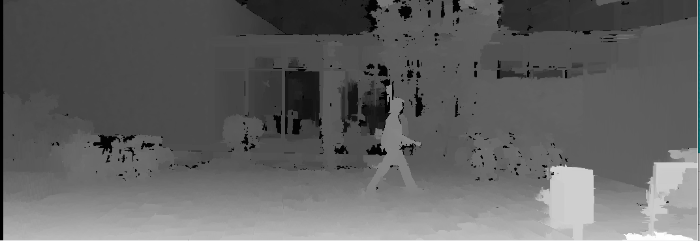

# Stereo Image Analysis

The KITTI dataset provides stereo images that are recorded by the two cameras that are mounted on the car. 
each image taken during the car ride is saved in two files (right and left). 
The stereo image capture can be used to build a 3D representation of the environment in front of the car using a technique that is similar to biological binocular vision.
To compute the disparity map, I used the SBDM (Semi-Global Block-Matching) algorithm which 

Let's see an example of combinig two images (left and right) to one 3d image (generated with stereo_image_disparity.py):

Right Image

Left Image

Disparity analysis without WLS filter

Disparity analysis with WLS filter

Looking at the example, it is clear that the person is located in different lcoations in each image. On the right image the person is closer to the right than on the left image. The difference in y axis depends on the actual distance between the cameras on the car.

Now let's compare the disparity analysis to the LIDAR capture of the same frame:

The actual distance of the objects can be calculated is the camera focal length is known as well as the fixed distance between the cameras according to the following formula:

d- disparity
f- Cameras focal length
b- Distance between cameras
D- object Distance
D = b*f/d
